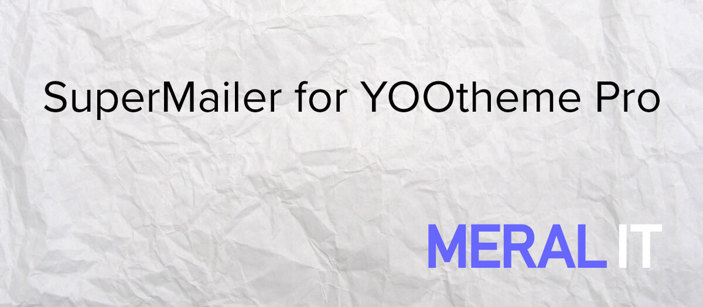

# Meral-IT SuperMailer Element for YOOtheme Pro Joomla! Plugin

Meral-IT SuperMailer Element for YOOtheme Pro is an extension for the [YOOtheme Pro page builder](https://yootheme.com/page-builder) which adds more elements to the element library.

Copyright (C) 2024 Meral-IT.

This program is free software: you can redistribute it and/or modify
it under the terms of the GNU General Public License as published by
the Free Software Foundation, either version 3 of the License, or
(at your option) any later version.

This program is distributed in the hope that it will be useful,
but WITHOUT ANY WARRANTY; without even the implied warranty of
MERCHANTABILITY or FITNESS FOR A PARTICULAR PURPOSE. See the
GNU General Public License for more details.

You should have received a copy of the GNU General Public License
along with this program. If not, see <https://www.gnu.org/licenses/>.

The SuperMailer element is based on the Newsletter element, Copyright (C) 2016-2023 YOOtheme GmbH.

## Description

This plugin adds more elements to the element library of the YOOtheme Pro page builder.

- SuperMailer Element: Display a Newsletter form to integrate with the SuperMailer Newsletter system.

## Installation

- download the latest release package from the [releases page](https://github.com/NecatiMeral/yootheme-supermailer/releases) (*Assets 🠖 Source code (zip) or Source code (tar.gz)*)
- install it via the Joomla! extensions manager
- access the YOOtheme Pro Page Builder, the custom elements should now be available

## Issues

If you want to report an issue, please use the [Github issue tool](https://github.com/NecatiMeral/yootheme-supermailer/issues).

## Links

- [Source Code](https://github.com/NecatiMeral/yootheme-supermailer)
- [YOOtheme Pro Documentation](https://yootheme.com/support/yootheme-pro/joomla/introduction)
- [YOOtheme Support](https://yootheme.com/support)

## Screenshots

Y'all know it: *when it's done*
